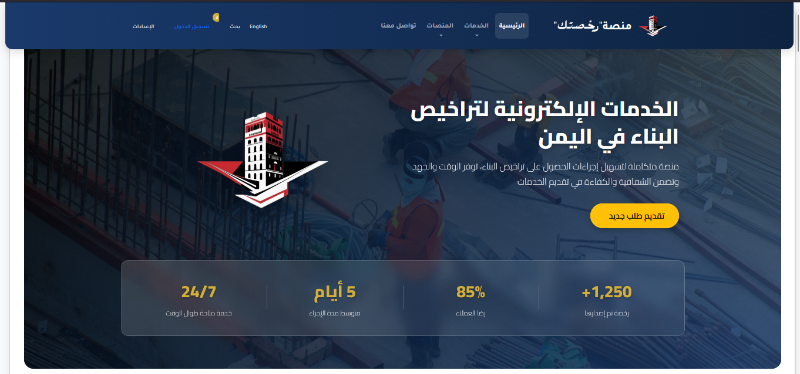
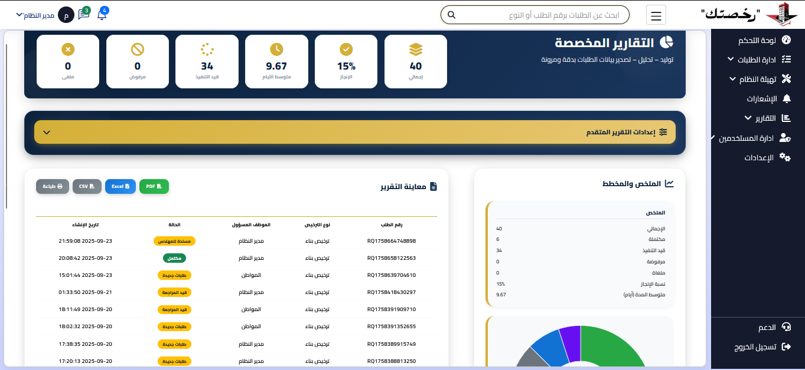
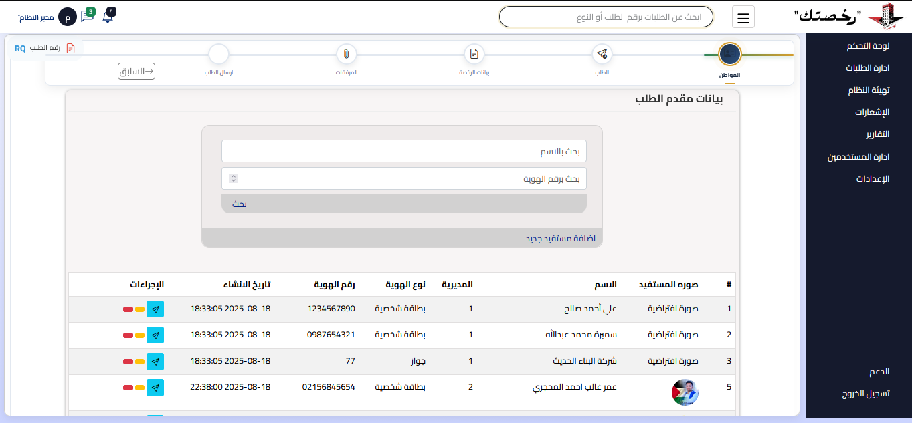

<!--
    Project README: Building Permit Management System
-->

# Building Permit Management System

A web-based system built with Laravel for managing building permit applications, including user-facing interfaces for submitting requests, tracking status, and generating reports.

---

## Project Description

This system allows users to submit building permit applications, track their status, and generate summarized and detailed reports. It includes the following features:

- User registration and authentication system.
- Complete online application form (attachments, location data, owner information).
- Dashboard for viewing and managing user requests.
- Generation and export of PDF reports (summary and detailed).
- Notifications and activity logging system.

---

## Key Features

- User and role management
- Application submission and tracking
- File attachments per request
- PDF report generation and printing

---

## Screenshots

Home Page:

Request Page:

Report Example:

---

## Important Files

- Report Controller: `app/Http/Controllers/ReportController.php`
- Report Views: `resources/views/modules/auth/reports/`
- Attachments Storage: `storage/attachments/`

---

## Contributing

If you would like to contribute or report an issue, feel free to open an Issue or submit a Pull Request on the project repository.

---

## License

Open-source project — see `composer.json` and repository files for more details.
